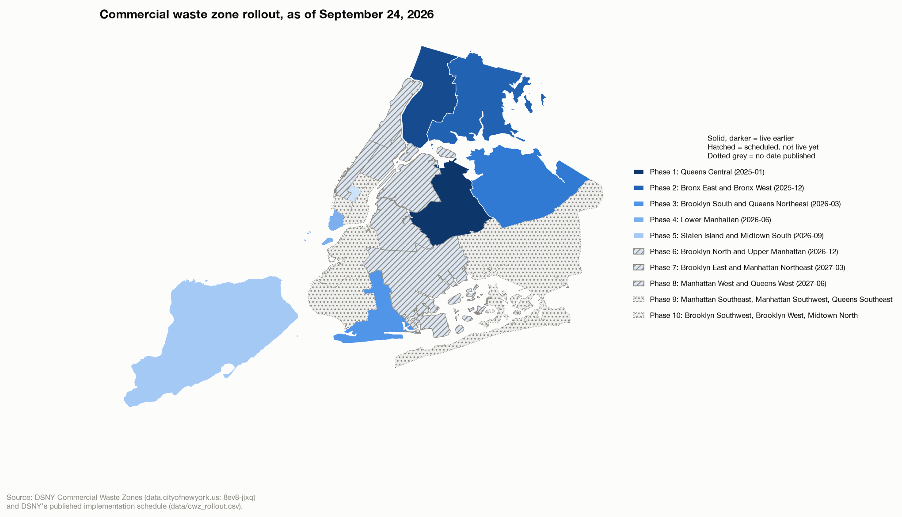
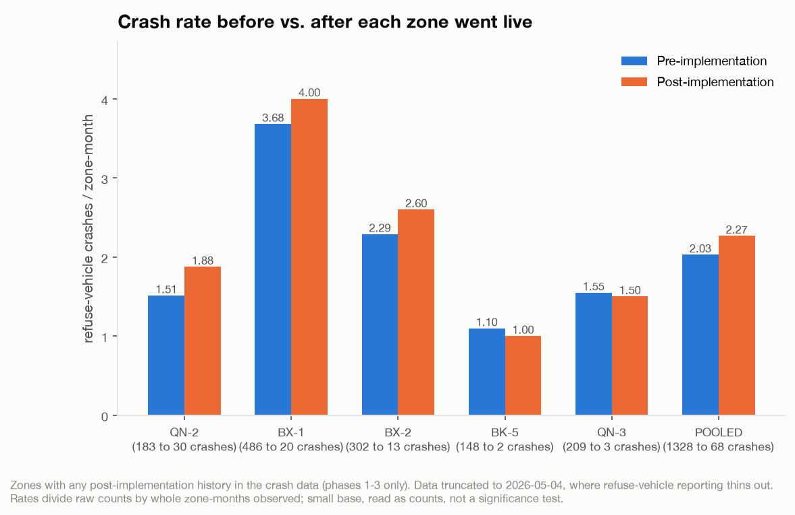

# Are Commercial Waste Zones Safer?

Evaluating the safety angle of the commercial waste zone policy

In 2019 NYC passed Local Law 199 which created a program that would divide NYC up into 20 zones and assign each an approved set of waste carriers. Among the stated goals of the program were to improve safety by reducing the aggregate number of miles that waste vehicles would travel.

The [20 zones](https://data.cityofnewyork.us/City-Government/DSNY-Commercial-Waste-Zones/8ev8-jjxq/about_data) are being rolled out in phases. As of today, 8 zones across the first five phases are live, and the first, Queens Central, has been running long enough — implemented 2025-01-03 — that the city's crash data carries about 17 months of history against it. That gives us a real, if still early, setup to measure whether the commercial waste zones are in fact achieving their safety goals.

**tl;dr - commercial waste zones are not safer.** Comparing pre vs. post crash data in implemented zones and implemented versus non-implemented zones shows a more or less flat line when it comes to vehicle incidents.

## The Setup

Since 8 of the 20 zones have activated with the commercial waste zone policy, we can perform two comparisons:

* **Pre vs. Post implementation** - look at the number of accidents and rate of accidents in activated zones.  If the program was increasing safety there should be fewer accidents and these measures should drop.
* **Implemented vs. Non-Implemented** - compare how the rate of accidents in implemented zones compares to non-implemented zones.  The non-implemented zones act as a control here, and let us better isolate the impact of just the commercial waste zones.

Since the total number of accidents is low we get the most robust results when we aggregate the rates across all zones instead of looking at them one by one.

To help visualize things, here is a map of the implemented and to-be implemented zones:

| Phase | Zone(s) | Implementation date | Status (as of 2026-09-24) |
|---|---|---|---|
| 1 | Queens Central | 2025-01-03 | Live |
| 2 | Bronx East and Bronx West | 2025-12-01 | Live |
| 3 | Brooklyn South and Queens Northeast | 2026-03-01 | Live |
| 4 | Lower Manhattan | 2026-06-01 | Live |
| 5 | Staten Island and Midtown South | 2026-09-01 | Live |
| 6 | Brooklyn North and Upper Manhattan | 2026-12-01 | Scheduled |
| 7 | Brooklyn East and Manhattan Northeast | 2027-03-01 | Scheduled |
| 8 | Manhattan West and Queens West | 2027-06-01 | Scheduled |
| 9 | Manhattan Southeast, Manhattan Southwest, Queens Southeast | — | No date published |
| 10 | Brooklyn Southwest, Brooklyn West, Midtown North | — | No date published |

While eight phases are implemented today, we can only use three of them because the vehicle crash data is stale since June 2026, and our [recent attempt](https://urbancalc.substack.com/p/the-citys-crash-data-was-never-missing) to recreate the missing crash data does not have the fields we need for this analysis.  That leaves phases 1 through 3 (five zones: Queens Central, Bronx East, Bronx West, Brooklyn South, and Queens Northeast) with any sufficient history to measure against.

## The Results

From the pre vs. post comparison it is clear that the commercial waste zone policy does not improve safety within the zone.

There is no decrease in the crash rate (crashes per month) for the majority of the zones.  Because some of the zones only have a few months of implementation history and there are only a few crashes per month the most statistically valid result here is in the POOLED bar - in aggregate, the rate rises 10% from 2.03 to 2.27 crashes per month, well within what we can consider noise in the crash data (p=53%, two-sided bootstrap against each zone's own pre-implementation distribution).  This means there is **no positive safety impact in these commercial waste zones after implementation**.

We can look at this a different way by comparing implemented to non-implemented zones to control for any systemic improvement (or decline) in safety citywide.  If we index every zone to its monthly crash rate from 2019, we see that indexed accident rates in implemented zones are **21% higher** than in non-implemented zones.  These would be significantly lower if we were looking at evidence of a safety improvement.  This is again within what we can consider noise for the data (p=24%, two-sided bootstrap against a null where each zone's rate stays at its own 2019 level), indicating that there is no positive safety impact in the commercial waste zones.

## Conclusions

In so far as the commercial waste zones are supposed to be an answer to address the [troubling increasing share of crashes](https://urbancalc.substack.com/i/217012768/the-mostly-positive-accidents-are-dropping) that are attributed to waste trucks, it is not clear it is achieving its goals.

That is not to say there are not other benefits. But from a safety perspective, between this and [gaps in side guard coverage](https://urbancalc.substack.com/i/217012768/side-impact-guards) on BIC trade waste trucks, it indicates that the city needs better solutions that prioritize safety in waste management.

## Further Reading

- [DSNY: Commercial Waste Zones rollout schedule](https://www.nyc.gov/site/dsny/businesses/cwz/rollout-schedule.page) — the implementation dates used throughout this piece.
- [DSNY: Commercial Waste Zones program page](https://www.nyc.gov/site/dsny/businesses/commercial-waste-zones.page) — program overview and goals.
- [Waste Dive: "New York shuffles commercial waste zone timing in areas affected by M&A"](https://www.wastedive.com/news/new-york-commercial-waste-zone-mamdani-dsny-implementation/817497/) (2026-04-15) — on schedule changes and the city's commitment to full implementation by end of 2027.
- [Waste Dive: "Inside the first year of NYC's historic commercial waste reform plan"](https://www.wastedive.com/news/new-york-dsny-commercial-waste-reform-bic-action-cogent-nwra/803787/) — a first-year retrospective on the program.
- [NYC Open Data: DSNY Commercial Waste Zones dataset](https://data.cityofnewyork.us/City-Government/DSNY-Commercial-Waste-Zones/8ev8-jjxq) — the zone boundaries used in the map above.
- [Center for NYC Affairs: "Lagging Reforms Mean Lingering Hazards in Private Waste Collection"](https://www.centernyc.org/urban-matters-2/lagging-reforms-mean-lingering-hazards-in-private-waste-collection) - an opinionated recap of the commercial waste zone program as of 2024
- [Brad Lander's call for for improvements in Commercial Waste Zone law](https://comptroller.nyc.gov/newsroom/sanitation-department-awards-contracts-to-commercial-waste-haulers-with-hundreds-of-safety-environmental-and-labor-violations-comptroller-finds/) - press release from then Comptroller Brad Lander
