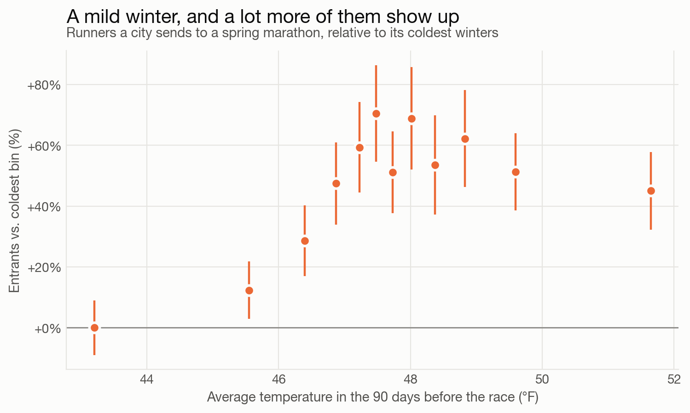
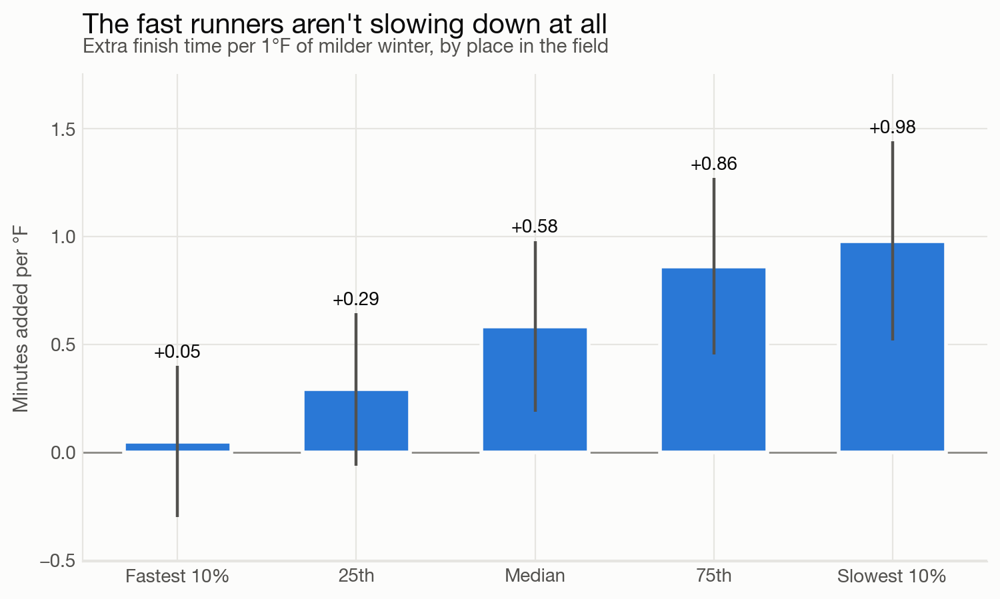
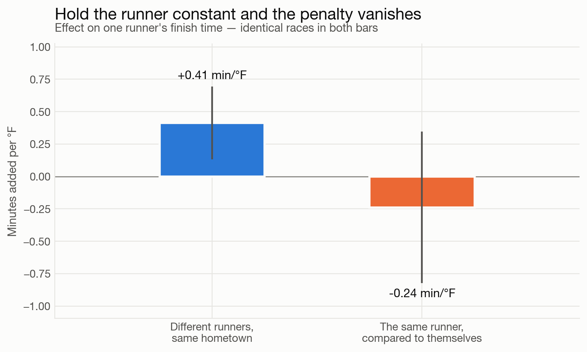

# Impact of Training Weather on Marathon Times

### Does a mild winter make a city's runners slower?

*Thatcher Clay · 8/22/2026*

---

With an unprecedented El Nino phenomenon brewing in the air, I got thinking about how weather during marathon training impacts performance.  How does the weather we experience during our training block impact us come race day?  Do race times suffer when the months leading up to a race are unusually cold, or when there are a lot of wet days?

To get more specific/researchable, here is the question I tried to answer: *if a particular city gets a mild, dry winter, do runners from that city show up to spring races faster?*  

**tl;dr — no!** A mild winter doesn't make anyone faster or slower. What it changes is **who shows up**. *A mild 90 days beforehand brings 45–70% more runners* out of a city, and almost all of the extra bodies land in the back half of the field.

I looked at results from ~1,300 US marathons — a million finishers with a hometown attached — and joined each runner to the daily weather in *their own city* for the 90 days before their race. Then I grouped runners by their home town and race: everyone from Seattle at the 2016 Chicago Marathon, everyone from Denver at the 2011 Boston, and so on. Because each city appears at many races and each race has runners from many cities, I can hold the city fixed and the race fixed, and just ask what a warmer training block did.

From there I kept only the **spring marathons** — March through May, 284 races and 220,000 finishers. That way the 90-day window is always winter, and the thing that varies is simply how hard a winter each city got.

The turnout effect is not subtle.

If the winter leading up to a race is mild in a particular city, that city will tend to send dramatically more people to the race. About **5% more runners for every degree** the winter ran warm. Rainfall or snowfall does not seem to make a difference either way.

Now looking at race results, when a particular city has a mild winter racers from that city are on average *slower on race day*. The median finish time creeps up about **35 seconds per degree** of extra warmth. That seems a bit odd... let's look at the distribution by pace.

*Extra finish time per 1°F of warmer training, by place in the field*

The fastest tenth of the field doesn't speed up or slow down with changing training weather — 3 seconds per degree, which is nothing. The slowest tenth picks up **a full minute per degree**, close to double the median penalty. Warm training weather does not press down on the field, it stretches it out at the back.

We can verify this by looking at results that have names attached.  Assuming name/hometown is reasonably unique (I know, not perfect), we can observe how different training season weather impacts performance on races in different years.

*Effect of a 1°F milder winter on an individual's finish time. Both bars use the same races and hold the race fixed; they differ only in whether the comparison is between different people or within one person.*

Nothing. If anything particular runners are slightly faster if they have warmer training weather — though with this many fewer races to work from, the honest read is that the effect is somewhere between "small benefit" and "nothing at all." What it clearly isn't is the penalty you see when you compare *different* people. The dominant effect is from who turns out to race.

Which is, when you think about it, a reasonable result. The dedicated crowd trains through whatever January hands them. Mild weather gives everybody else a reason to sign up — and a first-timer's 5:20 lands in the same results file as your PR.

And to those diehard runners out doing long runs in the snowy February days hoping to get an edge on the other fast runners - turns out, everyone is doing that.  Training weather does not make a big difference to the sharp end - they are fast and going to be fast regardless.
