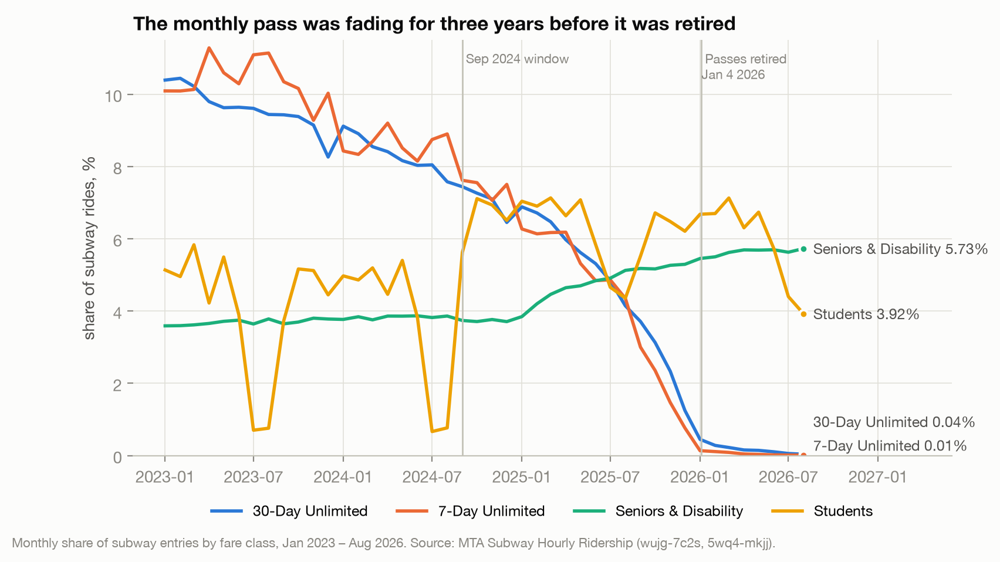
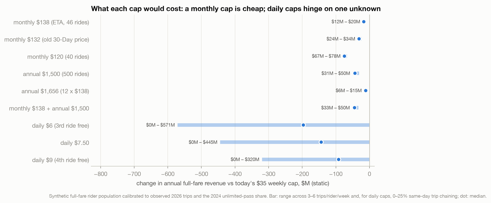
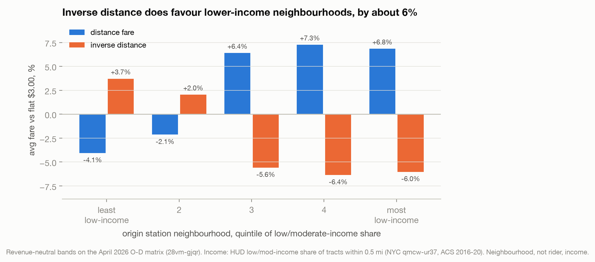

# Outline — alternative fare structures

Prospective article built on `research/fare-proposals.md` (spec_fare_proposals.md),
with context from `research/additional-questions.md`. Format follows the sibling
pieces (`truck_safety`, `bus_lane_violations`): first person, ~1,100–1,300 words,
bold key figures, H2 sections, figures from `lib/`, closing "Parting Thoughts" and
"Caveats". Source for every number is in brackets — strip before publishing.

---

## Working title

**Four Ways to Price a Subway Ride**

Alternatives: *The Cheapest Fix the MTA Isn't Making* · *What Would a Fairer Fare
Cost?*

**Dek:** The MTA chair says he's open to new fare caps before next year's increase.
I modelled four alternatives to the weekly cap. One is cheap and well-targeted, one
helps poorer neighbourhoods in a clumsy way, one hinges on a number only the MTA
has, and one mostly helps the MTA.

---

## Lead (~150 words)

- Hook: on Sept 23, MTA chair Janno Lieber said he's open to caps beyond the weekly
  one and wants an "equity oriented fare structure", ahead of a planned 2027 fare
  increase. [sources.md, Streetsblog 2026-09-23]
- The window is open, so what would the alternatives actually cost, and who would
  they help?
- One line on method, kept plain: the MTA's open data counts taps by station and
  hour, never by rider, so parts of this needed a modelled rider population.
  Say how confident each answer is as you go.

## What riders lost in January (~200 words)

- Jan 4, 2026: base fare $2.90 → $3.00; the 7-Day, 30-Day and Express Bus Plus
  MetroCards retired and "replaced with the automatic fare cap". The cap is weekly.
  [doc 186881]
- **The monthly pass was $132.** A daily rider now pays up to **$151.67** a month:
  **+14.9%**, against a 3.4% base-fare increase. [doc 118601; cap arithmetic]
  → Candidate stat tile, not a chart: $132 → $151.67.
- It didn't vanish overnight. The 30-Day was 10.4% of rides in Jan 2023, 7.4% in
  Sept 2024, 3.7% in Sept 2025 and effectively zero by Feb 2026. Riders were
  already drifting to OMNY, where no monthly option existed.
  
- Keep this section short; it is the setup, not the story. If a companion piece
  runs the pass-retirement angle (`article/outline.md`), link to it instead.

## Option 1 — Bring back the month, as a cap (~250 words)

*Strongest result; lead the proposals with it.*

- Effective Transit Alliance's proposal: 46 rides in 30 days, $138. [Streetsblog
  2026-02-18]
- **Cost: about $12–20M a year**, under half a percent of full-fare revenue.
  [p34_cap_grid.csv] A second, independent method — 2024 monthly-pass holders ×
  the $13.67 monthly gap — gives $18–27M. [additional-questions.md Q5] Two routes,
  overlapping answers; say so, it's the credibility beat.
- Who benefits: the most frequent riders, 5–11% of full-fare riders; a rider who
  caps every week saves $13.67 a month, $164 a year.
- Variations, one sentence each:
  - Cap at the old $132 price: $24–34M.
  - Annual cap at 12 × $138: almost nothing ($6–15M), because few people ride
    heavily every month of the year.
-  — introduce here, return to it for Option 3.

## Option 2 — Charge short trips more (inverse distance) (~300 words)

*The most interesting section: the premise holds, and it still disappoints.*

- The idea: long commutes subsidised, short hops pay more, on the theory that
  people travelling far are more likely to need the break.
- Revenue-neutral version on the MTA's own trip-level estimates: **$3.75** under
  2 miles, **$3.15** for 2–5, **$2.50** for 5–9, **$1.90** over 9. [p1_*,
  28vm-gjqr]
- **The premise checks out.** Stations in lower-income neighbourhoods do send
  riders farther (5.5 vs 3.9 miles on average), and the three lowest-income fifths
  of neighbourhoods would pay **~6% less**. Bronx −10%, Rockaways about −27%.
  
- Contrast in one line: a conventional distance fare, the kind most systems use,
  does the reverse and lands hardest on the Bronx (+11.5%). [fig5 — optional, or
  fold into fig7, which already shows both]
- **But it's blunt.** Even from the lowest-income neighbourhoods, **48% of trips
  get more expensive**: the local trip to school, the clinic, the shops.
- And short trips are the easiest to swap for walking or cycling. If those riders
  respond to price more than average, the scheme loses **2–5%** of revenue instead
  of breaking even.
- Land it: the city already has a tool that targets need directly, Fair Fares
  (half fare, means-tested). Distance is a noisy stand-in for income.

## Option 3 — A daily pass (~200 words)

*The honest answer is "it depends on one number". Make that the point.*

- Modelled as a daily cap: pay up to $6 (or $7.50, $9) in a day, then free.
- **It costs nothing for commuters**, who already hit the weekly cap. It only pays
  out on busy days, e.g. errands after work or visitors.
- So the cost swings from **$0 to ~$570M a year**, depending on how often riders
  take three or more trips in a day. Nobody outside the MTA knows that share; OMNY
  does. [p34_cap_grid.csv; fig8's long bars]
- Worth one line: the natural market is visitors, and an opt-in paid day pass would
  cost less, but it brings back the MetroCard problem of guessing in advance.

## Option 4 — Make riders prepay, E-ZPass style (~200 words)

- The spec's framing: hold a reserve in an account, let the MTA keep the float.
- E-ZPass NY's own rules: keep about a month of charges on account, auto-replenish,
  "No interest will be paid on balances." [NYSTA TA-W68167A]
- **The MTA would hold ~$234M of riders' money and earn ~$10M a year** at today's
  4.24% T-bill rate ($5–18M across assumptions). [p2_float_grid.csv; FRED]
- The cost falls on riders: the typical rider fronts ~$49, a daily rider ~$150, to
  get something tap-to-pay gives them today with no account.
- Unused-balance "breakage" could be bigger, but it's unknowable in advance.
  For scale: the MTA made ~$200M from unused MetroCard balances in the decade to
  2010, about $20M a year [Gothamist 2014-01-17, citing the NYT; verify the NYT
  original]. Vending amounts that left odd remainders helped [I Quant NY /
  Gizmodo, 2014-09-10]. Frame it as a risk riders carry, not a revenue line.
- Kicker: the float (~$10M) is about what the monthly cap costs ($12–20M). If the
  MTA wants a funding source for Option 1, this is one, but it's a poor trade for
  riders.

## Parting Thoughts (~150 words)

- Rank them plainly:
  1. The monthly cap is cheap, targets the most frequent riders, and restores what
     January took away.
  2. Inverse distance reaches the right neighbourhoods, but by a noisy route.
  3. The daily cap is unknowable from outside the MTA.
  4. Prepaid float mainly moves money from riders to the MTA.
- Close on the missing number. **One MTA table would settle most of this:** OMNY
  taps per card, per day and per week, even in bins. If Lieber wants an
  equity-oriented fare, publishing it is the first step. (Mention the
  public-records request if one is filed.)

## Caveats (~150 words, bullets)

- The MTA's data counts taps, not people. Options 1, 3 and 4 use a modelled rider
  population, calibrated to real 2026 trip totals and the 2024 unlimited-pass
  share. It matches the audited revenue model (about 4% of taps free under the
  cap), but it is a model. Every figure is a range.
- Static estimates: nobody rides more because a cap makes trips free. ETA cites
  ~4% ridership gains from monthly caps elsewhere.
- Full-fare riders only; reduced-fare, Fair Fares and student fares are left out.
- Inverse distance uses neighbourhood income around the starting station
  (2016–2020 ACS via HUD), not the rider's own, and straight-line distance.
  Staten Island isn't in the trip data.
- The daily cap result depends on an unmeasured share of busy days.

---

## Production notes

- **Figures available:** fig1 (context), fig7 (inverse distance), fig8 (caps).
  fig5 is optional since fig7 already contrasts both distance schemes. fig2–4 and
  fig6 belong to the pass-retirement piece, not this one.
- **Figures to consider making:**
  - A $132 → $151.67 stat tile.
  - A simple "who pays more / less" station map for inverse distance
    (`output/p1_inverse_distance_by_origin.csv` has lat/lon).
- **Decide before drafting:** whether this stands alone or is part two of the
  pass-retirement piece. If part two, cut "What riders lost" to three sentences
  and link.
- **Verify before publishing:**
  - Lieber quote wording (Streetsblog).
  - ETA's 46-ride figure and ~4% ridership claim (Streetsblog, Feb 2026).
  - E-ZPass consumer $25 minimum (sourced from the E-ZPass NY site via search,
    not the saved T&C PDF).
  - The ~$200M-per-decade breakage figure: Gothamist is citing the New York
    Times; find and cite the NYT original.
- **Unresolved items that don't block this piece** (research-log): the July 31
  "OMNY – Other" jump; student card validity changes.
