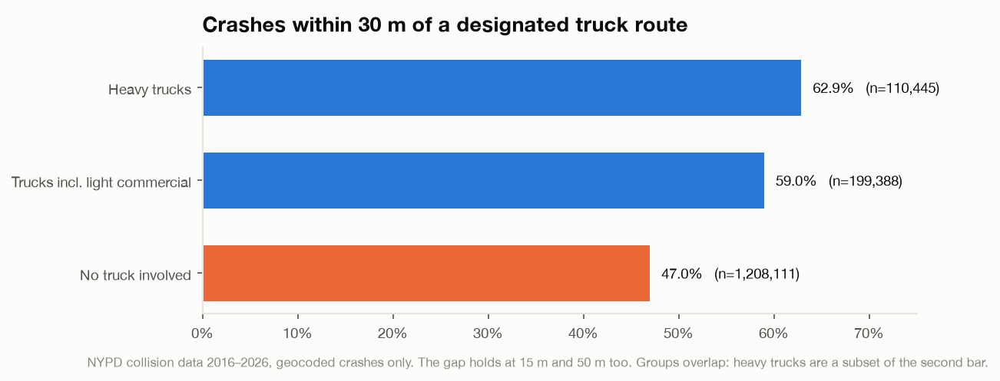
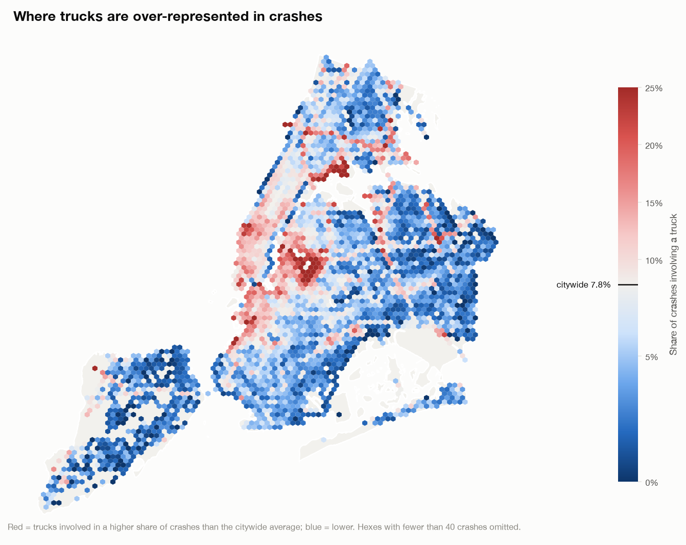
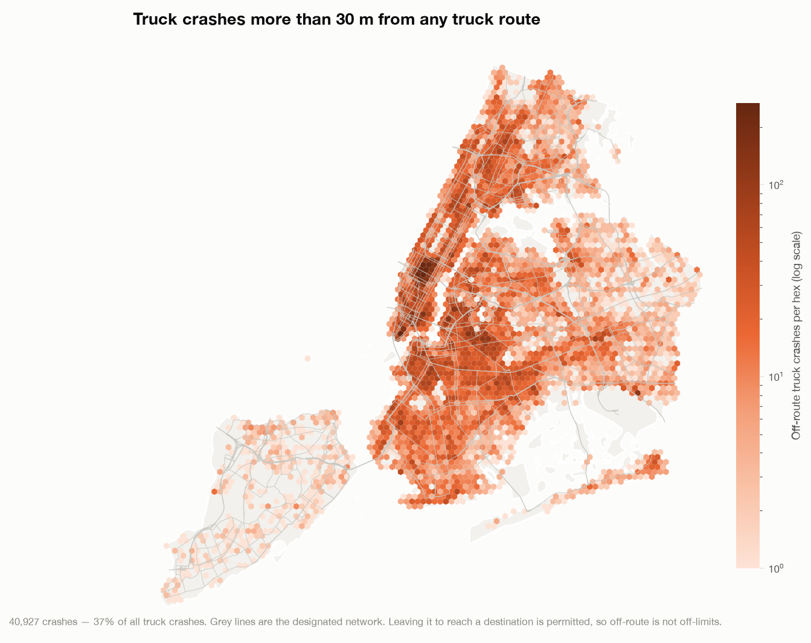
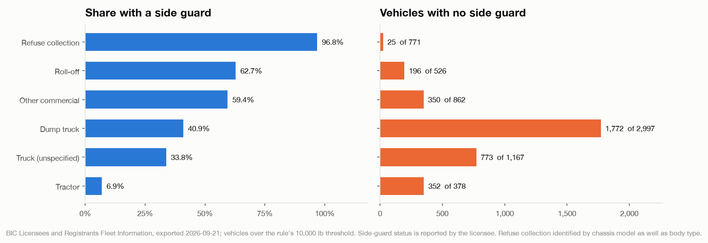
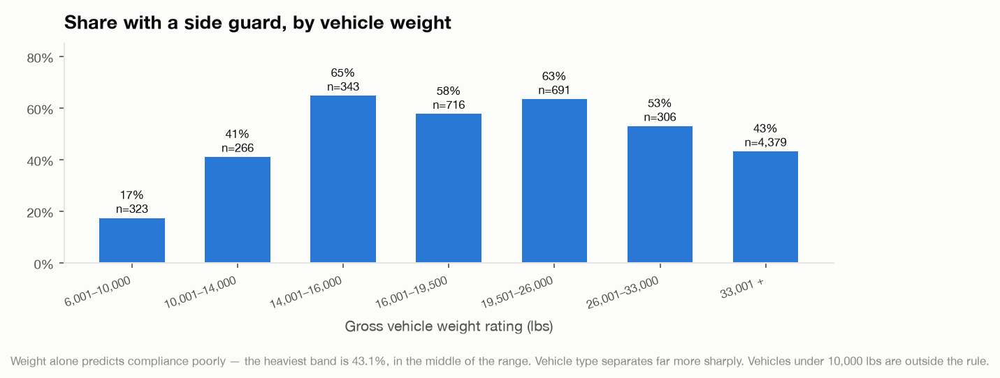
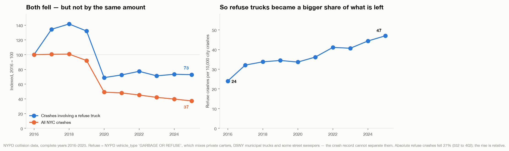

# Truck Safety

Trucks are both essential to the operation of NYC and terrifying to be next to as a car, pedestrian, or cyclist. Despite the fact that they are involved in only **7.9% of traffic incidents**, they are involved in **14.2% of fatalities**, and **28.6% of cyclist deaths**. The city understands this, and attempts to put in place guardrails to allow trucks to safely navigate our streets. Two of them are **approved truck routes** and the requirement for **side impact guards**.

Let's see how the data pans out on those safeguards.

## Truck Routes

New York designates a network of streets that commercial vehicles are required to use — about 33,000 segments of it, split between through routes for movements crossing the city and local routes for reaching a destination off the through network. The DOT actually just recently made a [major update](https://www.nyc.gov/html/dot/html/pr2026/nyc-dot-complete-mandated-truck-route-redesign.shtml) to those routes for the first time since the 1970s, but for the purposes of our analysis (which are backward looking) we will use the existing maps.

The good news first: the network works. Since we are looking at safety we can look at the vehicle collision data, and when trucks are involved in incidents, it is far more likely that they will be on their designated routes.

Nearly 63% of crashes involving a heavy truck happen within 30 metres of a designated route against a backdrop of 47% of crashes with no truck involved — a 16 point gap. Trucks are, broadly, where they are supposed to be.

It varies a lot by borough, though. The gap is widest in Queens (+14 points), the Bronx and Brooklyn (+12 each). It nearly vanishes in Manhattan (+4), where the network covers so much of the grid that being "on route" barely narrows anything down.

Overlaid on the city, incidents involving trucks are overrepresented near industrial areas or where goods are heavily being moved.

Citywide, a truck is involved in 7.9% of crashes. The red areas run to double that and beyond, and they are two quite different kinds of place.

The first is the industrial geography you would expect. Hunts Point is the most truck-heavy ZIP in the city by a wide margin — a third of all crashes there involve a truck. Greenpoint is at 20%, and the belt running through Maspeth, Long Island City and the Brooklyn waterfront is close behind.

The second is the commercial core, which is less obvious but just as red. The Garment District sits at 19.7%, Tribeca and Canal Street at 16.2%, Chelsea at 16.1%, Times Square at 15.6%, downtown Brooklyn between 12 and 13%. Manhattan as a whole has the highest truck share of any borough, 11.2%.

My interpretation of this is that by land area, most residential areas are "safe" with respect to traffic incidents involving trucks. But lower Manhattan and downtown Brooklyn in particular sit at a dangerous position at the intersection of lots of pedestrian/cyclist traffic and lots of truck related incidents.

We can look at a similar cut, this time by the concentration of traffic incidents involving trucks where the trucks are off the prescribed routes, where it is even clearer that these incidents are happening in pedestrian dense areas.

Nearly 41,000 truck crashes since 2016 happened away from the designated network.

It is worth stating that **being off-route is not illegal.** Trucks can leave the network to reach a destination by the most direct path, i.e. handle last mile delivery. Off-route trucking is a reality of our delivery focused economy, so we should expect to see accidents in those areas. If the trucks are going to be there, then we should make them safe. Like with...

## Side Impact Guards

Side guards are important because they prevent one of the worst case outcomes - a pedestrian or cyclist being pulled under the truck and into the wheels. This is often the way fatalities happen - trucks turn into the path of pedestrians or cyclists, they hit on the side of the truck and are pulled under.

In 2015 the City Council introduced a law mandating that heavy trucks would need side guards, which prevent pedestrians and cyclists from being pulled underneath the vehicle when there is a collision, with a mandated compliance date of January 1, 2023.

The rule runs on two tracks. DCAS administers it for the city's own fleet and for city contractors; the Business Integrity Commission administers it for the private trade waste industry it licenses. DCAS reported its side-guard programme complete in January 2023, covering roughly 4,000 city vehicles.

On the private side, the story is bi-modal, refuse collection is covered, other vehicles are spotty.

The trucks that actually collect garbage are in good shape. Purpose-built refuse collection vehicles — rear and front-end loaders — are **96.8% equipped**, with just 25 of 771 missing a guard.

But garbage trucks are about a tenth of the trucks the BIC oversees. The rest is the construction-and-demolition end of the trade waste business, and that is where the guards are missing.

More than half the heavy vehicles BIC licenses — **3,468 of 6,701** — have no side guard on record. Nearly all of them are concentrated in three categories: **1,772 dump trucks**, **773 generic trucks**, and **352 tractors** (93% of them).

We can look at this differently too, by vehicle weight. There we can see that 57% of the heaviest class of vehicles in the fleet operate without side guards.

## The (mostly) Positive - Accidents are Dropping

Overall the number of vehicle accidents precipitously declined in 2020 and never bounced back. Total crashes fell from 229,833 in 2016 to 85,546 in 2025, down 63%. Interestingly though, refuse trucks did not fall at the same pace. They fell too, from 552 to 402, which is only down 27%. So as a relative share of all incidents, refuse related truck incidents are on the rise.

There are some questions there that the data alone does not answer.

So, still some work to do to make the city safe.
